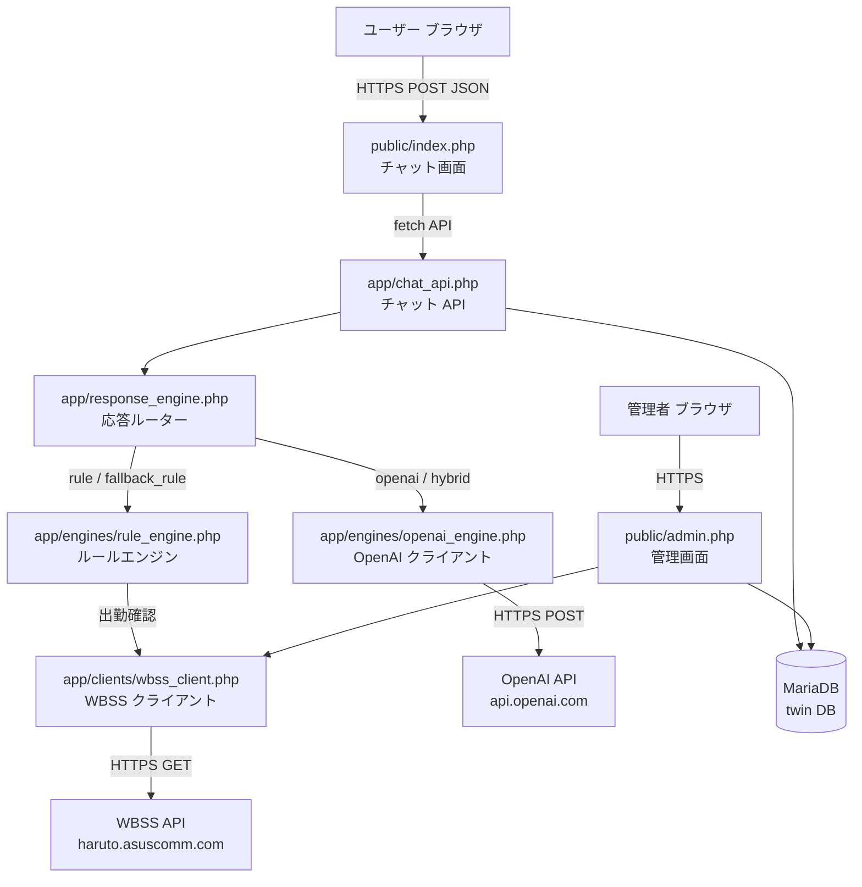
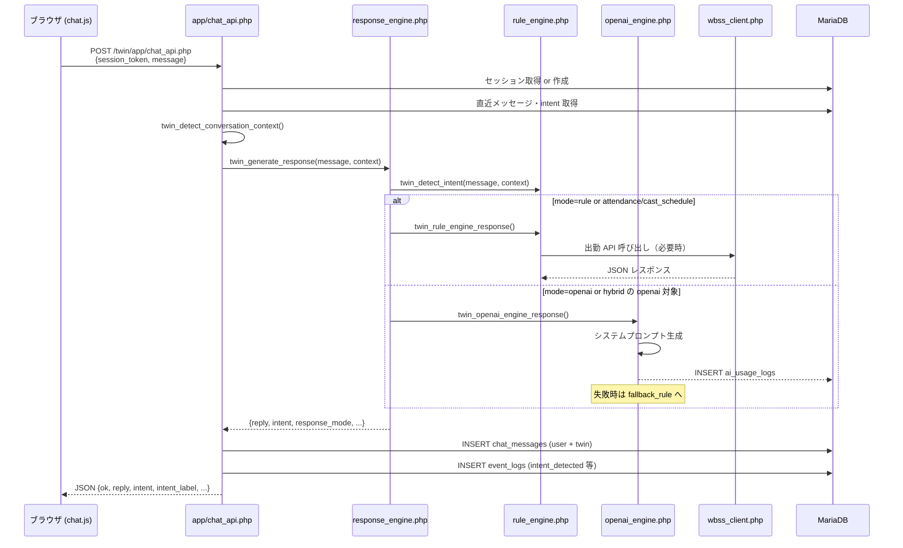
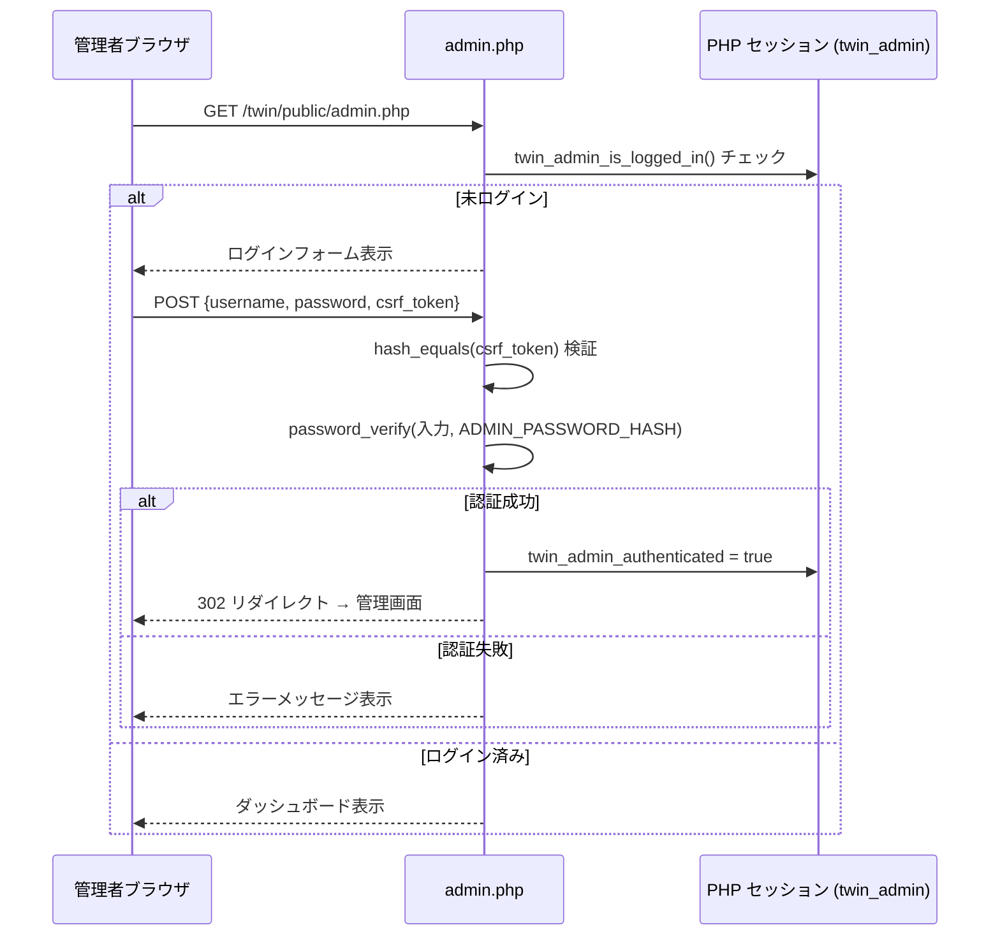

# Project TWIN 技術仕様書

**バージョン:** v0.8.2  
**最終更新:** 2026-06-21  
**対象読者:** サーバー移設担当者・将来の開発者・引継ぎ先 AI

---

## 目次

1. [システム概要](#1-システム概要)
2. [アーキテクチャ](#2-アーキテクチャ)
3. [技術スタック](#3-技術スタック)
4. [サーバー要件](#4-サーバー要件)
5. [環境変数一覧](#5-環境変数一覧)
6. [データベース設計](#6-データベース設計)
7. [API仕様](#7-api仕様)
8. [セキュリティ設計](#8-セキュリティ設計)
9. [ログ設計](#9-ログ設計)
10. [デプロイ手順](#10-デプロイ手順)
11. [バックアップ](#11-バックアップ)
12. [障害対応](#12-障害対応)
13. [今後の拡張予定](#13-今後の拡張予定)
14. [システム成熟度評価](#14-システム成熟度評価)

---

## 1. システム概要

### Project TWIN の目的

「TWIN SEIKA」（岡山・中央町のキャバクラ店舗）のウェブサイト訪問者が来店前に抱く不安・疑問を解消するチャットボットシステム。

- 来店ハードルを下げ、LINE 予約・料金ページ・Instagram への導線につなげる
- ルールエンジン（キーワードマッチング）と OpenAI API を組み合わせた Hybrid 応答
- WBSS 出勤管理 API によるリアルタイム出勤情報案内
- 管理画面による会話分析・KPI モニタリング・応答モード切替

### 想定利用者

| 利用者 | 用途 |
|---|---|
| 来店検討中のユーザー | チャット UI でキャスト・料金・雰囲気等を質問 |
| 店舗スタッフ / オーナー | 管理画面でセッション分析・応答モード変更 |
| 開発者 / AI | 本仕様書、コード、管理画面エクスポートで引継ぎ |

### システム構成図



---

## 2. アーキテクチャ

### ディレクトリ構成

```
/path/to/twin/                      ← プロジェクトルート（非公開）
├── public/                         ← DocumentRoot（ここだけ公開）
│   ├── index.php                   ← チャット画面
│   ├── admin.php                   ← 管理画面（認証必須）
│   ├── admin_export.php            ← データエクスポート（認証必須）
│   └── assets/
│       ├── css/style.css           ← スタイルシート
│       ├── js/chat.js              ← チャット UI（Vanilla JS）
│       └── img/twin-seika.jpeg     ← ヒロイン画像
├── app/                            ← アプリロジック（非公開）
│   ├── config.php                  ← 設定統合（環境変数 → config.local.php → デフォルト値）
│   ├── config.local.php            ← 本番ローカル設定（Git 管理外）
│   ├── db.php                      ← PDO 接続・ロギング
│   ├── settings.php                ← app_settings テーブル操作
│   ├── chat_api.php                ← チャット API エンドポイント
│   ├── response_engine.php         ← 応答モードルーター
│   ├── question_ranking.php        ← 質問ランキング集計ロジック
│   ├── admin_common.php            ← 管理画面認証・CSRF
│   ├── engines/
│   │   ├── rule_engine.php         ← キーワードルールエンジン・intent 判定
│   │   └── openai_engine.php       ← OpenAI API クライアント
│   ├── clients/
│   │   └── wbss_client.php         ← WBSS 出勤 API クライアント
│   └── knowledge/
│       └── seika.php               ← 店舗ナレッジ（料金・営業時間・場所等）
├── database/
│   ├── schema.sql                  ← 初期スキーマ
│   └── migrations/
│       ├── 002_add_intent_to_chat_messages.sql
│       ├── 003_add_conversation_analytics.sql
│       ├── 006_create_app_settings.sql
│       └── 007_create_ai_usage_logs.sql
├── docs/
│   ├── SYSTEM_SPEC.md              ← 本ドキュメント
│   ├── AI_HANDOFF.md               ← AI 引継ぎメモ
│   └── UPDATE_HISTORY.md           ← 更新履歴
├── storage/
│   └── logs/
│       └── app.log                 ← アプリログ（書き込み権限必要）
└── README.md
```

### レイヤー構成

```
┌─────────────────────────────────────┐
│  プレゼンテーション層                    │
│  public/index.php (HTML/CSS/JS)     │
│  public/admin.php (管理 UI)          │
├─────────────────────────────────────┤
│  API 層                              │
│  app/chat_api.php  (チャット POST)    │
│  public/admin_export.php            │
├─────────────────────────────────────┤
│  ビジネスロジック層                     │
│  app/response_engine.php            │
│  app/engines/rule_engine.php        │
│  app/engines/openai_engine.php      │
│  app/question_ranking.php           │
├─────────────────────────────────────┤
│  インフラ / 外部連携層                  │
│  app/clients/wbss_client.php        │
│  app/db.php (PDO)                   │
│  app/knowledge/seika.php            │
└─────────────────────────────────────┘
```

### リクエストフロー



### 認証フロー（管理画面）



---

## 3. 技術スタック

### PHP

| 項目 | 内容 |
|---|---|
| バージョン | 8.1 以上必須（`str_contains()`・`str_starts_with()`・`never` 型使用） |
| 実行環境での確認バージョン | PHP 8.4.21 (raspi4) |
| スタイル | `declare(strict_types=1)` 全ファイルに記述 |
| フレームワーク | **なし**（純粋 PHP） |
| オートローダー | **なし**（`require_once` による手動読み込み） |
| パッケージ管理 | **なし**（Composer 未使用） |

### データベース

| 項目 | 内容 |
|---|---|
| RDBMS | MariaDB 10.3 以上 / MySQL 8.0 以上 |
| 接続方式 | PDO（`PDO::ATTR_EMULATE_PREPARES => false`） |
| 文字コード | `utf8mb4` / `utf8mb4_unicode_ci` |
| ストレージエンジン | InnoDB（外部キー制約使用） |

### JavaScript

| 項目 | 内容 |
|---|---|
| フレームワーク | **なし**（Vanilla JS、IIFE パターン） |
| 通信 | Fetch API（`Content-Type: application/json`） |
| セッション | `window.sessionStorage`（タブ単位でトークン管理） |
| トークン生成 | `window.crypto.getRandomValues()`（48 バイト hex = 96 文字） |
| 非対応ブラウザ | IE 非対応（Fetch API・crypto.getRandomValues 必須） |

### 外部 API

| サービス | エンドポイント | 認証 | 用途 |
|---|---|---|---|
| OpenAI API | `https://api.openai.com/v1/chat/completions` | `Authorization: Bearer {KEY}` | AI 会話応答生成 |
| WBSS 出勤 API | `https://haruto.asuscomm.com/wbss/public/api/twin/` | `X-TWIN-API-KEY: {KEY}` | キャスト出勤情報取得 |

WBSS のサブエンドポイント：

| エンドポイント | 用途 | 主なパラメータ |
|---|---|---|
| `attendance.php` | 全キャスト出勤一覧取得 | `store=seika`, `date=YYYY-MM-DD`（省略可） |
| `cast_schedule.php` | 個別キャスト出勤確認 | `store=seika`, `cast={castName}`, `date=YYYY-MM-DD`（省略可） |

### セッション管理

| セッション名 | 用途 | 保存内容 |
|---|---|---|
| `twin_chat_state` | チャット会話コンテキスト | `last_context`, `last_cast_name`, `last_cast_status` |
| `twin_admin` | 管理画面認証 | `twin_admin_authenticated`, `twin_admin_csrf_token`, `twin_admin_login_error` |

---

## 4. サーバー要件

### 必須要件

| 項目 | 要件 | 根拠 |
|---|---|---|
| PHP | **8.1 以上** | `str_contains()` / `str_starts_with()` / `never` 返り値型使用 |
| MariaDB / MySQL | **MariaDB 10.3+ / MySQL 8.0+** | InnoDB・外部キー・`utf8mb4` 必須 |
| PHP 拡張: `pdo_mysql` | 必須 | DB 接続に PDO 使用 |
| PHP 拡張: `curl` | 必須 | OpenAI API・WBSS API 呼び出し |
| PHP 拡張: `json` | 必須 | API 通信の JSON エンコード/デコード |
| PHP 拡張: `mbstring` | 必須 | 日本語文字列処理（`mb_strpos()` 等） |
| PHP 拡張: `openssl` | 必須 | `password_verify()`（bcrypt 検証） |
| PHP 拡張: `session` | 必須 | PHP セッション管理 |
| DocumentRoot | `public/` サブディレクトリ指定可能 | `app/` 等を Web 非公開にするため |
| HTTPS | 必須 | API キー・セッション通信の保護 |
| アウトバウンド TCP 443 | **開放必須** | OpenAI API・WBSS API への HTTPS |
| `storage/logs/` 書き込み | Apache 実行ユーザーに付与 | アプリログ出力 |

### 推奨要件

| 項目 | 推奨値 |
|---|---|
| PHP バージョン | 8.2 以上 |
| `memory_limit` | 128MB 以上 |
| `max_execution_time` | 30 秒以上（OpenAI タイムアウト 8 秒 + マージン） |
| OPcache | 有効推奨 |
| SSL 証明書 | Let's Encrypt または同等 |

### Apache 設定

```apache
<VirtualHost *:443>
    DocumentRoot /path/to/twin/public
    ServerName example.com

    # API キー・認証情報を環境変数で注入
    SetEnv OPENAI_API_KEY             "sk-xxxx"
    SetEnv WBSS_TWIN_API_KEY          "your-wbss-key"
    SetEnv TWIN_DB_HOST               "127.0.0.1"
    SetEnv TWIN_DB_DATABASE           "twin"
    SetEnv TWIN_DB_USERNAME           "twin_user"
    SetEnv TWIN_DB_PASSWORD           "your-db-password"
    SetEnv ADMIN_USERNAME             "admin"
    SetEnv ADMIN_PASSWORD_HASH        "$2y$12$..."

    # 管理画面への Basic 認証（任意・推奨）
    <FilesMatch "^admin">
        AuthType Basic
        AuthName "TWIN Admin"
        AuthUserFile /etc/apache2/.htpasswd
        Require valid-user
    </FilesMatch>

    SSLEngine on
    SSLCertificateFile    /etc/letsencrypt/live/example.com/fullchain.pem
    SSLCertificateKeyFile /etc/letsencrypt/live/example.com/privkey.pem
</VirtualHost>
```

> **注意:** `.htaccess` は未使用。`mod_rewrite` は不要。

### Nginx 設定

```nginx
server {
    listen 443 ssl;
    root /path/to/twin/public;
    index index.php;

    location / {
        try_files $uri $uri/ /index.php?$query_string;
    }

    location ~ \.php$ {
        fastcgi_pass unix:/run/php/php8.2-fpm.sock;
        fastcgi_param SCRIPT_FILENAME $document_root$fastcgi_script_name;
        include fastcgi_params;

        # SetEnv の代替（PHP-FPM 経由で環境変数を渡す）
        fastcgi_param OPENAI_API_KEY    "sk-xxxx";
        fastcgi_param WBSS_TWIN_API_KEY "your-wbss-key";
        fastcgi_param TWIN_DB_PASSWORD  "your-db-password";
        fastcgi_param ADMIN_PASSWORD_HASH "$2y$12$...";
    }

    # app/ 以下への直接アクセス禁止
    location ~* ^/(app|database|docs|storage)/ {
        deny all;
        return 404;
    }

    ssl_certificate     /etc/letsencrypt/live/example.com/fullchain.pem;
    ssl_certificate_key /etc/letsencrypt/live/example.com/privkey.pem;
}
```

> **注意:** Nginx では `fastcgi_param` で環境変数を渡す。`app/` 以下の保護は `location` ブロックで明示的に設定が必要（Apache の DocumentRoot 設定のみの場合は自動保護されない）。

---

## 5. 環境変数一覧

`config.php` が環境変数 → `config.local.php` → デフォルト値の順で解決する。

| 環境変数名 | 用途 | 必須/任意 | デフォルト値 |
|---|---|---|---|
| `OPENAI_API_KEY` | OpenAI API キー | **必須**（AI モード使用時） | `''`（空 → ルールモードにフォールバック） |
| `WBSS_OPENAI_API_KEY` | `OPENAI_API_KEY` の旧エイリアス | 任意 | — |
| `WBSS_TWIN_API_KEY` | WBSS 出勤 API キー | **必須**（出勤機能使用時） | `''`（空 → 出勤情報取得不可） |
| `TWIN_API_KEY` | `WBSS_TWIN_API_KEY` の旧エイリアス | 任意 | — |
| `TWIN_DB_HOST` | DB ホスト | 任意 | `127.0.0.1` |
| `TWIN_DB_PORT` | DB ポート | 任意 | `3306` |
| `TWIN_DB_DATABASE` | DB 名 | 任意 | `twin` |
| `TWIN_DB_USERNAME` | DB ユーザー名 | 任意 | `twin_user` |
| `TWIN_DB_PASSWORD` | DB パスワード | **必須**（本番） | `change_me` |
| `ADMIN_USERNAME` | 管理画面ログイン ID | 任意 | `newname` |
| `ADMIN_PASSWORD_HASH` | 管理画面パスワード（bcrypt ハッシュ） | **必須**（本番） | config.php 記載値 |
| `OPENAI_MODEL` | OpenAI 使用モデル名 | 任意 | `gpt-4.1-mini` |
| `OPENAI_TIMEOUT_SECONDS` | OpenAI API タイムアウト（秒） | 任意 | `8` |
| `WBSS_API_BASE_URL` | WBSS API ベース URL | 任意 | `https://haruto.asuscomm.com/wbss/public/api/twin` |
| `WBSS_API_TIMEOUT_SECONDS` | WBSS API タイムアウト（秒） | 任意 | `5` |
| `TWIN_LINE_URL` | LINE 予約 URL | 任意 | `https://line.me/R/ti/p/%40nuu4414x` |
| `TWIN_PRICE_URL` | 料金ページ URL | 任意 | `https://okayama-seika.com/#system` |
| `TWIN_INSTAGRAM_URL` | Instagram URL | 任意 | `https://www.instagram.com/club_.seika/` |
| `OPENAI_INPUT_COST_PER_1M_TOKENS_USD` | input トークン単価（USD/1M） | 任意 | `0.40` |
| `OPENAI_OUTPUT_COST_PER_1M_TOKENS_USD` | output トークン単価（USD/1M） | 任意 | `1.60` |
| `USD_JPY_RATE` | USD→JPY 換算レート | 任意 | `150.0` |

### `config.local.php` による代替設定

環境変数が設定できないサーバー（一部共有レンタルサーバー等）では `app/config.local.php` で代替できる。このファイルは **Git 管理外**で、Web からアクセス不可な場所に配置すること。

```php
<?php
return [
    'openai_api_key'    => 'sk-xxxx',
    'wbss_twin_api_key' => 'your-wbss-key',
    'db' => ['password' => 'your-db-password'],
    'admin_password_hash' => '$2y$12$...',
];
```

---

## 6. データベース設計

### テーブル一覧

| テーブル名 | 用途 | 主キー |
|---|---|---|
| `chat_sessions` | チャットセッション管理 | `id` BIGINT UNSIGNED AUTO_INCREMENT |
| `chat_messages` | ユーザー・TWIN の全発言 | `id` BIGINT UNSIGNED AUTO_INCREMENT |
| `event_logs` | システムイベント記録 | `id` BIGINT UNSIGNED AUTO_INCREMENT |
| `app_settings` | 管理画面設定（応答モード等） | `id` BIGINT UNSIGNED AUTO_INCREMENT |
| `conversion_events` | コンバージョン記録（将来拡張用） | `id` BIGINT UNSIGNED AUTO_INCREMENT |
| `ai_usage_logs` | OpenAI API 利用量・概算コスト | `id` BIGINT UNSIGNED AUTO_INCREMENT |

### chat_sessions

| カラム | 型 | 説明 |
|---|---|---|
| `id` | BIGINT UNSIGNED | 主キー |
| `session_token` | VARCHAR(64) UNIQUE | ブラウザ側 `sessionStorage` に保存された hex トークン |
| `started_at` | DATETIME | セッション開始日時 |
| `ended_at` | DATETIME NULL | セッション終了日時（`trial_finished` イベント時） |
| `message_count` | INT UNSIGNED NULL | ユーザー発言数 |
| `session_duration_seconds` | INT UNSIGNED NULL | 滞在秒数 |
| `user_agent` | VARCHAR(500) NULL | UA 文字列 |
| `ip_address` | VARCHAR(45) NULL | IPv4 / IPv6 |

### chat_messages

| カラム | 型 | 説明 |
|---|---|---|
| `id` | BIGINT UNSIGNED | 主キー |
| `session_id` | BIGINT UNSIGNED | FK → chat_sessions.id（CASCADE DELETE） |
| `sender` | ENUM('user','twin') | 発話者 |
| `message` | TEXT | 発言内容 |
| `intent` | VARCHAR(50) NULL | 判定 intent（例: `price`, `cast_schedule`） |
| `created_at` | DATETIME | 記録日時 |

### event_logs

intent 判定・CTA クリック・WBSS API 呼び出し結果・OpenAI 実行等を記録する汎用イベントテーブル。

| カラム | 型 | 説明 |
|---|---|---|
| `id` | BIGINT UNSIGNED | 主キー |
| `session_id` | BIGINT UNSIGNED | FK → chat_sessions.id（CASCADE DELETE） |
| `event_name` | VARCHAR(64) | イベント種別（下表参照） |
| `event_value` | VARCHAR(1000) NULL | イベント付加情報 |
| `created_at` | DATETIME | 記録日時 |

主な `event_name` 一覧：

| event_name | event_value 例 | 説明 |
|---|---|---|
| `chat_start` | NULL | セッション開始 |
| `intent_detected` | `price` | intent 判定結果 |
| `conversation_context` | `waiting_cast_confirmation` | 会話コンテキスト |
| `response_mode` | `hybrid` | 応答モード |
| `cast_name_detected` | `もも` | キャスト名抽出 |
| `cast_schedule_found` | `schedule:出勤予定` | WBSS 個別出勤確認結果 |
| `cast_schedule_not_found` | `not_found` | WBSS キャスト未登録 |
| `attendance_success` | `count:5` | WBSS 全体出勤取得成功 |
| `attendance_error` | `HTTP 503` | WBSS 取得失敗 |
| `recommend_cast_executed` | NULL | キャスト推薦実行 |
| `cta_view` | `line` / `price` / `instagram` | CTA 表示 |
| `cta_click` | `line` / `price` / `instagram` | CTA クリック |
| `trial_finished` | NULL | 無料体験終了 |
| `openai_request` | `model=gpt-4.1-mini; intent=other` | OpenAI リクエスト開始 |
| `openai_success` | `status=200; intent=other` | OpenAI 成功 |
| `openai_error` | エラーメッセージ | OpenAI 失敗 |
| `openai_fallback` | エラーメッセージ | OpenAI → rule フォールバック |
| `openai_usage_saved` | `tokens=350; session=42` | usage ログ保存成功 |
| `message_sent` | NULL | TWIN 返答送信完了 |

### app_settings

| カラム | 型 | 説明 |
|---|---|---|
| `id` | BIGINT UNSIGNED | 主キー |
| `setting_key` | VARCHAR(100) UNIQUE | 設定キー（例: `response_mode`） |
| `setting_value` | TEXT | 設定値（例: `hybrid`） |
| `updated_at` | DATETIME | 更新日時 |

現時点で利用しているキー：

| setting_key | 値の例 | 説明 |
|---|---|---|
| `response_mode` | `rule` / `openai` / `hybrid` | 応答モード |

### conversion_events

**現時点では将来拡張用テーブル。** `cta_click` 発生時に `conversion_type` を記録するが、集計は `event_logs` で行っている。

| カラム | 型 | 説明 |
|---|---|---|
| `session_id` | BIGINT UNSIGNED | FK → chat_sessions.id（CASCADE DELETE） |
| `conversion_type` | VARCHAR(50) | `line` / `price` / `instagram` |
| `created_at` | DATETIME | 記録日時 |

### ai_usage_logs

| カラム | 型 | 説明 |
|---|---|---|
| `session_id` | BIGINT UNSIGNED | FK なし（参照のみ） |
| `model` | VARCHAR(100) | モデル名（例: `gpt-4.1-mini`） |
| `prompt_tokens` | INT UNSIGNED | 入力トークン数 |
| `completion_tokens` | INT UNSIGNED | 出力トークン数 |
| `total_tokens` | INT UNSIGNED | 合計トークン数 |
| `estimated_cost_usd` | DECIMAL(10,8) | 概算コスト（USD） |
| `estimated_cost_jpy` | DECIMAL(10,4) | 概算コスト（JPY） |
| `created_at` | DATETIME | 記録日時 |

---

## 7. API仕様

### チャット API

**エンドポイント:** `POST /twin/app/chat_api.php`  
**Content-Type:** `application/json`

#### アクション: メッセージ送信

**リクエスト:**
```json
{
  "session_token": "a1b2c3d4e5f6a1b2c3d4e5f6a1b2c3d4e5f6a1b2c3d4e5f6",
  "action": "message",
  "message": "料金はいくらですか？"
}
```

**レスポンス（成功）:**
```json
{
  "ok": true,
  "reply": "セット料金は税込6,600円（1時間）からです。お一人でのご来店でも安心して楽しめますよ。何か他にご質問はありますか？",
  "intent": "price",
  "intent_label": "料金",
  "response_mode": "rule",
  "conversation_context": null,
  "cast_name_detected": null,
  "reply_html": "セット料金は税込6,600円（1時間）からです。..."
}
```

**レスポンス（エラー）:**
```json
{
  "ok": false,
  "error": "500文字以内で入力してください。"
}
```

#### アクション: イベント記録

**リクエスト:**
```json
{
  "session_token": "a1b2c3d4...",
  "action": "event",
  "event_name": "cta_click",
  "event_value": "line"
}
```

**許可される `event_name`:**
`trial_finished`, `cta_view`, `cta_click`, `line_clicked`, `instagram_clicked`, `price_clicked`, `cta_click_line`, `cta_click_price`, `cta_click_instagram`, `cta_view_line`, `cta_view_price`, `cta_view_instagram`

**レスポンス:**
```json
{ "ok": true }
```

#### バリデーション・制限

| 項目 | 制限 |
|---|---|
| `session_token` 形式 | `/^[a-f0-9]{32,64}$/` に一致すること |
| `message` 最大長 | 500 文字（`mb_strlen` で計測） |
| レート制限 | 直前メッセージから 1 秒以上経過していること（429 返却） |
| HTTP メソッド | POST のみ（他は 405） |

### 管理 API

`public/admin.php` と `public/admin_export.php` は HTML 画面兼 API。  
認証済みセッションが必要（`twin_admin` セッション）。

#### admin_export.php

**エンドポイント:** `GET /twin/public/admin_export.php?format=json`  
**認証:** 管理画面セッション必須

`analysis_json` を出力。含まれるキー：

| キー | 内容 |
|---|---|
| `other_messages` | 直近 50 件の `other` intent 発言 |
| `suggested_intents` | `other` 発言から自動検出した新 intent 候補 |
| `dropoff_sessions` | 離脱候補セッション |
| `line_opportunity_sessions` | LINE 誘導候補セッション |
| `response_improvement_candidates` | 返答改善候補 |
| `ai_usage_summary` | today/month/total コスト・トークン数 |
| `operations_summary` | 健康診断スコア・LINE CTR・other 率等 |
| `improvement_suggestions` | 優先度付き改善提案 |
| `real_question_ranking` | intent 別質問ランキング |
| `twin_health_score` | TWIN 健康診断スコア（100 点満点） |
| `openai_diagnostics` | OpenAI 呼び出し統計 |
| `health_score_breakdown` | スコア内訳 |

### OpenAI 連携

| 項目 | 内容 |
|---|---|
| エンドポイント | `https://api.openai.com/v1/chat/completions` |
| モデル | `gpt-4.1-mini`（環境変数で変更可） |
| `temperature` | `0.7` |
| `max_tokens` | `220` |
| タイムアウト | 8 秒（接続タイムアウト 3 秒） |
| システムプロンプト | `twin_openai_system_prompt()` で生成。店舗ナレッジ・人格・制約を含む |
| フォールバック | 失敗時は `rule_engine` で再応答（`response_mode=fallback_rule`） |

**ハイブリッドモードの振り分け:**

| エンジン | intent |
|---|---|
| ルールエンジン | `price`, `price_estimate`, `vip`, `drink_price`, `business_hours`, `location`, `attendance`, `cast_schedule`, `group_visit`, `arrival_time`, `crowd`, `reservation` |
| OpenAI | `anxiety`, `cast_type`, `recommend_cast`, `atmosphere`, `repeat_visitor`, `general_chat`, `other` |

`attendance` / `cast_schedule` は **モードに関わらず常にルールエンジン**で処理（WBSS API 連携が必要なため）。

### WBSS 連携

| 項目 | 内容 |
|---|---|
| 認証ヘッダー | `X-TWIN-API-KEY: {WBSS_TWIN_API_KEY}` |
| タイムアウト | 5 秒（接続タイムアウト 3 秒） |
| 失敗時の挙動 | エラーを返し、`attendance_error` / `cast_schedule_error` をログ記録してチャット継続 |
| `count=0` の扱い | 「出勤なし」と断定せず「情報取得中・LINE 確認を促す」 |
| not_found 処理 | HTTP 4xx でも「見つかりません」メッセージは `ok:true` に変換して正常扱い |

---

## 8. セキュリティ設計

### 認証

| 対象 | 方式 | 実装箇所 |
|---|---|---|
| 管理画面 | PHP セッション + bcrypt パスワード検証 | `app/admin_common.php` |
| チャット API | session_token（hex 48 バイト、`sessionStorage`） | `app/chat_api.php` |

管理者パスワードのハッシュ生成：
```bash
php -r "echo password_hash('your_password', PASSWORD_BCRYPT, ['cost' => 12]);"
```

### セッション

| 項目 | 内容 |
|---|---|
| セッション名（チャット） | `twin_chat_state`（PHP セッション） |
| セッション名（管理） | `twin_admin`（PHP セッション） |
| チャットのトークン管理 | ブラウザ `sessionStorage`（タブ単位、ページリロードで消える） |
| 管理 CSRF トークン | `bin2hex(random_bytes(16))`、`hash_equals()` で検証 |

### SQL インジェクション対策

全 SQL 操作に **PDO プリペアドステートメント** を使用。`ATTR_EMULATE_PREPARES => false` で真のプリペアドを強制。

```php
// 実装例（chat_api.php）
$stmt = $pdo->prepare('SELECT id FROM chat_sessions WHERE session_token = :session_token LIMIT 1');
$stmt->execute(['session_token' => $token]);
```

動的な `LIMIT` 値は `max(1, (int)$limit)` でキャストしてからクエリ文字列に埋め込む。

### XSS 対策

| 場所 | 実装 |
|---|---|
| PHP テンプレート | `htmlspecialchars($value, ENT_QUOTES \| ENT_SUBSTITUTE, 'UTF-8')`（`e()` 関数） |
| JS でのメッセージ挿入 | `div.textContent = value`（DOM API による自動エスケープ） |
| API レスポンスの `reply_html` | サーバー側で `htmlspecialchars()` 適用済み |

### API キー管理

- API キーはソースコードに直書きしない
- `SetEnv`（Apache）/ `fastcgi_param`（Nginx）/ `config.local.php`（Git 管理外）で管理
- 管理画面・API レスポンスに API キー値は一切表示しない
- `config.local.php` は `.gitignore` で除外

### その他

| 項目 | 内容 |
|---|---|
| `noindex` | チャット画面・管理画面ともに `<meta name="robots" content="noindex,nofollow">` |
| 管理画面 | `X-Robots-Tag: noindex, nofollow` ヘッダーも付与 |
| `X-Content-Type-Options` | チャット API レスポンスに `nosniff` ヘッダー付与 |
| rate limit | 直前メッセージから 1 秒未満の連続送信を 429 で拒否 |
| token 検証 | `/^[a-f0-9]{32,64}$/` に一致しない token は 400 で拒否 |

---

## 9. ログ設計

### アプリログ（`storage/logs/app.log`）

`twin_log()` 関数（`app/db.php`）が出力。

**フォーマット:**
```
[2026-06-21 22:00:00] chat_api_error {"message":"PDO exception message"}
```

**出力タイミング:**

| ログ名 | 状況 |
|---|---|
| `chat_api_error` | チャット API の Throwable キャッチ時 |
| `response_engine_fallback` | OpenAI → rule フォールバック時 |
| `response_engine_event_log_failed` | event_logs INSERT 失敗時 |

### PHP error_log（Apache / php-fpm のエラーログ）

`error_log()` 関数で出力。アプリログとは別ファイル（Apache のエラーログ先）。

| 出力箇所 | 内容 |
|---|---|
| `openai_engine.php` | `TWIN ai_usage_logs insert error: ...` |
| `openai_engine.php` | `TWIN ai_usage_logs warning: session_id is 0` |
| `openai_engine.php` | `TWIN ai_usage_logs saved: tokens=... session=...` |
| `wbss_client.php` | `[WBSS] API key is not configured.` 等 |

### ログ保管方針

| 項目 | 現状・推奨 |
|---|---|
| ローテーション | **未実装（TODO）**。手動削除または logrotate 設定を推奨 |
| 保管期間 | 未定義（要確認）|
| 個人情報 | ユーザーの発言内容が含まれる可能性あり。取り扱い注意 |
| バックアップ | DB は mysqldump 推奨。ログは定期 tar.gz 保管推奨 |

---

## 10. デプロイ手順

### 初回セットアップ

```bash
# 1. リポジトリをクローン
git clone https://github.com/yourrepo/project-twin.git /path/to/twin

# 2. ログディレクトリの権限設定
mkdir -p /path/to/twin/storage/logs
chmod 775 /path/to/twin/storage/logs
chown www-data:www-data /path/to/twin/storage/logs

# 3. DocumentRoot を public/ に設定（Apache / Nginx の VirtualHost を編集）

# 4. 環境変数を設定（Apache SetEnv または config.local.php を作成）
```

### DB 作成

```sql
CREATE DATABASE twin CHARACTER SET utf8mb4 COLLATE utf8mb4_unicode_ci;
CREATE USER 'twin_user'@'localhost' IDENTIFIED BY 'change_me';
GRANT ALL PRIVILEGES ON twin.* TO 'twin_user'@'localhost';
FLUSH PRIVILEGES;
```

### マイグレーション（初回・順番厳守）

```bash
mysql -u twin_user -p twin < /path/to/twin/database/schema.sql
mysql -u twin_user -p twin < /path/to/twin/database/migrations/002_add_intent_to_chat_messages.sql
mysql -u twin_user -p twin < /path/to/twin/database/migrations/003_add_conversation_analytics.sql
mysql -u twin_user -p twin < /path/to/twin/database/migrations/006_create_app_settings.sql
mysql -u twin_user -p twin < /path/to/twin/database/migrations/007_create_ai_usage_logs.sql
```

`CREATE TABLE IF NOT EXISTS` を使用しているため、既存テーブルがあっても安全に実行できる。

### 管理者パスワードのハッシュ生成

```bash
php -r "echo password_hash('your_admin_password', PASSWORD_BCRYPT, ['cost' => 12]) . PHP_EOL;"
# → 生成されたハッシュを ADMIN_PASSWORD_HASH 環境変数または config.local.php に設定
```

### 更新手順（通常の開発サイクル）

```bash
# 開発機（Mac）でコードを編集・コミット・プッシュ
git add app/engines/rule_engine.php
git commit -m "fix: cast_schedule intent restriction"
git push origin main

# 本番サーバーで反映
cd /path/to/twin
git pull --ff-only origin main

# DB マイグレーションが追加された場合のみ実行
mysql -u twin_user -p twin < database/migrations/NNN_*.sql
```

> **重要:** 本番サーバー（raspi4）での直接編集は禁止。必ず Mac（開発機）で編集・コミット・プッシュ → 本番で `git pull` の手順を踏むこと。

---

## 11. バックアップ

### DB バックアップ

```bash
mysqldump -u twin_user -p twin \
  --single-transaction \
  --routines \
  --triggers \
  | gzip > /backup/twin_$(date +%Y%m%d_%H%M%S).sql.gz
```

**定期実行推奨:** cron で日次バックアップを設定する（現状未設定 → TODO）。

### 設定ファイルバックアップ

```bash
# Git 管理外の重要ファイル（API キー含む）
cp /path/to/twin/app/config.local.php /backup/config.local.php.$(date +%Y%m%d)
```

| ファイル | 重要度 | 理由 |
|---|---|---|
| DB（mysqldump） | **最重要** | 全会話ログ・設定が含まれる |
| `app/config.local.php` | **最重要** | API キー・DB パスワードが含まれる |
| `storage/logs/app.log` | 任意 | 障害調査用 |
| アプリコード | GitHub が正 | `git clone` で復元可能 |

### リストア

```bash
# DB リストア
gunzip -c /backup/twin_20260101_120000.sql.gz | mysql -u twin_user -p twin

# ファイルリストア
git clone https://github.com/yourrepo/project-twin.git /path/to/twin
cp /backup/config.local.php /path/to/twin/app/config.local.php
```

---

## 12. 障害対応

### OpenAI API エラー

**症状:** チャットで AI 応答が返らない / `response_mode=fallback_rule` が頻発する

**確認手順:**
1. 管理画面 → 「AI診断」セクションで失敗回数・最終エラーを確認
2. `event_logs` の `openai_error` イベントでエラーメッセージを確認
   ```sql
   SELECT event_value, created_at FROM event_logs
   WHERE event_name = 'openai_error' ORDER BY id DESC LIMIT 10;
   ```
3. `OPENAI_API_KEY` が正しく設定されているか確認
   ```bash
   php -r "echo getenv('OPENAI_API_KEY') ? 'SET' : 'NOT SET';"
   ```
4. `curl` コマンドで API 疎通確認（キーの値は伏せること）
   ```bash
   curl -s -o /dev/null -w "%{http_code}" https://api.openai.com/v1/models \
     -H "Authorization: Bearer $OPENAI_API_KEY"
   # 200 が返れば疎通OK
   ```

**暫定対応:** 管理画面 → 応答モード → 「安定モード（rule）」に切り替える

### DB 接続エラー

**症状:** チャット・管理画面が「少し混み合っています」エラーを返す

**確認手順:**
1. `storage/logs/app.log` を確認
   ```bash
   tail -50 /path/to/twin/storage/logs/app.log
   ```
2. DB サービスの状態確認
   ```bash
   systemctl status mariadb
   # または
   mysql -u twin_user -p twin -e "SELECT 1;"
   ```
3. 環境変数・`config.local.php` の DB 接続情報を確認

### WBSS 接続エラー

**症状:** キャスト出勤案内で「LINE でご確認ください」が常に返る

**確認手順:**
1. 管理画面 → 「出勤 API（WBSS）」セクションで接続ステータス確認
2. `event_logs` の `attendance_error` を確認
   ```sql
   SELECT event_value, created_at FROM event_logs
   WHERE event_name = 'attendance_error' ORDER BY id DESC LIMIT 5;
   ```
3. `WBSS_TWIN_API_KEY` が設定されているか確認
4. WBSS API サーバー（`haruto.asuscomm.com`）への疎通確認
   ```bash
   curl -s -o /dev/null -w "%{http_code}" \
     "https://haruto.asuscomm.com/wbss/public/api/twin/attendance.php?store=seika" \
     -H "X-TWIN-API-KEY: $WBSS_TWIN_API_KEY"
   ```

**暫定対応:** 出勤案内が不正確になるが、他の機能は継続動作する（WBSS エラーはチャットを止めない設計）

### 権限エラー（ログ書き込み失敗）

**症状:** `storage/logs/app.log` が空のまま / ログが出力されない

**確認手順:**
```bash
ls -la /path/to/twin/storage/logs/
# → www-data（Apache ユーザー）が書き込めるか確認

# 権限修正
chmod 775 /path/to/twin/storage/logs/
chown www-data:www-data /path/to/twin/storage/logs/
```

### AI 利用額が ¥0 のまま

**症状:** 管理画面の AI 利用額が常に ¥0、`ai_usage_logs` テーブルが空

**確認手順:**
1. `ai_usage_logs` テーブルが存在するか確認
   ```sql
   SHOW TABLES LIKE 'ai_usage_logs';
   ```
2. マイグレーション `007_create_ai_usage_logs.sql` を実行済みか確認
3. PHP error_log で `TWIN ai_usage_logs warning: session_id is 0` が出ていないか確認
4. `event_logs` に `openai_success` があるか確認（OpenAI 自体は成功しているか）

---

## 13. 今後の拡張予定

コード・README から確認できた拡張予定・TODO を整理する。

### 店舗横展開（コード確認済み）

`app/knowledge/seika.php` は店舗ごとにナレッジファイルを切り替えられる設計になっている。

```
TODO: knowledge/kirin.php（別店舗1）
TODO: knowledge/creole.php（別店舗2）
```
*根拠: README.md「将来 knowledge/kirin.php や knowledge/creole.php に横展開しやすい構造に整理」*

### conversion_events テーブルの活用（未実装）

現在は `cta_click` 時に `line` / `price` / `instagram` を記録しているが、集計は `event_logs` で行っている。

```
TODO: line_add / reservation / visit などの来店確認まで追跡するコンバージョンファネル
```
*根拠: README.md「conversion_events は v0.4 時点では将来用」*

### WBSS 連携強化（コード内 TODO）

```
TODO: crowd / arrival_time の改善提案でWBSS混雑情報と連携する（question_ranking.php）
TODO: cast_type / recommend_cast の改善提案でWBSSキャスト属性と連携する
```
*根拠: `app/question_ranking.php` コメント*

### ログローテーション

```
TODO: storage/logs/app.log のローテーション設定（logrotate 等）
```

### cron によるデータ保守

```
TODO（将来予定）: 古いセッション・ログのアーカイブ・削除 cron
TODO（将来予定）: 日次 DB バックアップ cron
```
*現時点では cron ジョブなし*

### セキュリティ強化

```
TODO: 管理画面への Apache Basic 認証の追加（README で推奨済み・未実施可能性あり）
TODO: rate limit の強化（現在は 1 秒ルールのみ）
```

---

## 14. システム成熟度評価

| カテゴリ | 評価 | 根拠 |
|---|---|---|
| **Architecture** | ★★★☆☆ (3/5) | 単一責任・レイヤー分離は良好。ただし Composer/オートローダー未使用で `require_once` チェーン。フレームワークなしのため横展開時の一貫性維持が課題 |
| **Security** | ★★★★☆ (4/5) | PDO プリペアド・bcrypt・CSRF・XSS 対策・API キーの環境変数管理が揃っている。Basic 認証未設定の場合や `storage/` 権限設定漏れに注意 |
| **Maintainability** | ★★★★☆ (4/5) | 関数命名（`twin_` プレフィックス）・`declare(strict_types=1)`・バージョン管理が整備されている。UPDATE_HISTORY.md・AI_HANDOFF.md の存在も評価ポイント。Composer 未使用なため依存関係管理が手動 |
| **Deployability** | ★★★☆☆ (3/5) | Git ベースのデプロイフロー・マイグレーションスクリプトは整備されている。cron・ログローテーション未設定、環境変数の設定方法がサーバー依存（SetEnv vs fastcgi_param vs config.local.php）で移設時に手順の差異が出やすい |

**総評:**  
来店前チャットボットとしての機能要件は v0.8 時点でほぼ充足しており、本番運用に耐える品質。  
次のステップとして「ログローテーション・cron バックアップ・Composer 導入」を整備すると Deployability が ★★★★ に上がる。

---

## store_key 基盤 (v0.9.2)

### 概要

1つのコードベースで複数店舗に対応するための基盤。現時点では seika / creole の2店舗想定。

### ファイル構成

| ファイル | 役割 |
|---|---|
| `app/store.php` | `twin_current_store_key()` を定義。現在の対象店舗を返す |
| `app/knowledge/stores.php` | 全店舗の設定配列を管理。`twin_store_config()` でアクセス |
| `app/knowledge/seika.php` | 既存コード互換のため残存。新規コードは stores.php を使う |

### store_key 切替方法

```
# 環境変数
TWIN_STORE_KEY=creole

# config.local.php
'store_key' => 'creole',
```

### 店舗設定の主要フィールド

`store_key`, `display_name`, `store_name`, `area`, `address`, `business_hours`, `closed_days`,
`line_url`, `instagram_url`, `price_url`, `default_ai_name`, `default_role_label`,
`default_greeting`, `price_summary`, `wbss_store_key`

### AIキャラクター設定の store_key 分離

`ai_character_settings` テーブルの `store_id` カラムに store_key を保存。
有効な設定は `store_id` ごとに1件（`is_active=1`）。
設定がない場合は `stores.php` の `default_*` フィールドを使う。

## 管理画面ストア切替 (v0.9.3)

### 切替方法

トップバーの「TWIN SEIKA / TWIN CREOLE」ボタンをクリックするだけ。
内部では `?switch_store=<key>` → セッション保存 → リダイレクトの流れ。

### 優先順位（store_key 解決）

| 優先度 | 方法 | 用途 |
|---|---|---|
| 1 | 環境変数 `TWIN_STORE_KEY` | 本番固定（切替不可） |
| 2 | セッション `twin_admin_store_key` | 管理画面ボタン切替 |
| 3 | `config.local.php` の `store_key` | デプロイ設定 |
| 4 | デフォルト `'seika'` | フォールバック |

環境変数が設定されている場合、ボタンは表示されるが無効（🔒 env固定）。
